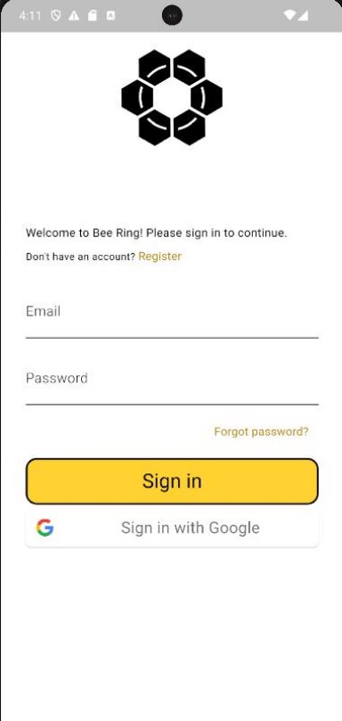
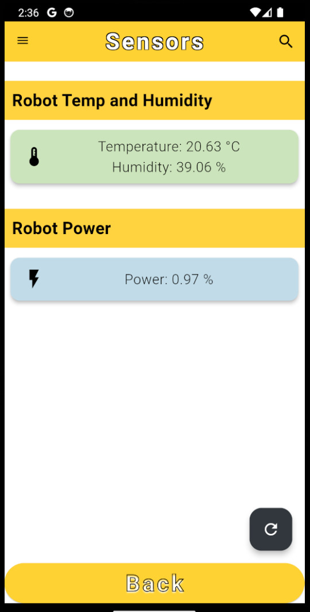
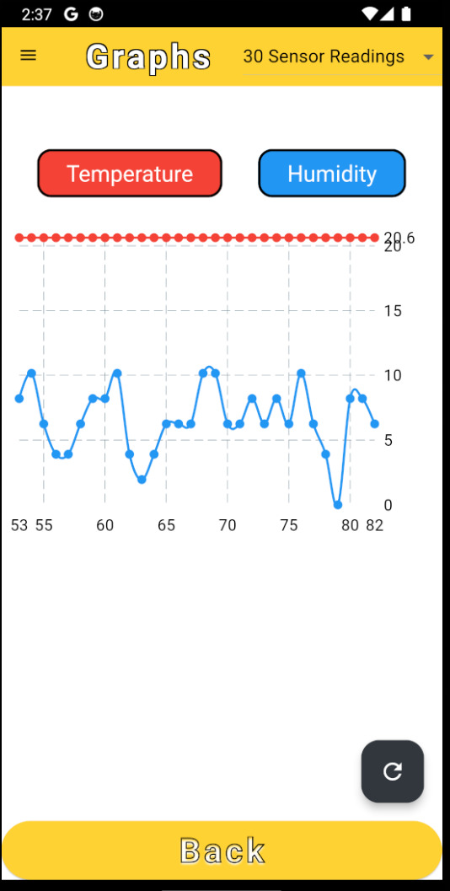

# Bee-Ring Technical Documentation

## Product Name: Bee-Ring App

#### Version: 1.0.0

#### Date: May 26, 2024

#### Team: Jon Nelson, Shannon Bell, Seongki Lee, Carter Nelson, Zoe Downen

Table of Contents

[**1.0 Product Overview 1**](#_page0_x72.00_y420.71)

[**2.0 Product Objectives 1**](#_page0_x72.00_y629.65)

0. [**Product Features 2**](#_page1_x72.00_y341.77)
   1. [Login Page 2](#_page1_x72.00_y503.10)
   1. [Dashboard 2](#_page1_x72.00_y645.92)
   1. [Alerts Page 3](#_page2_x72.00_y151.34)
   1. [Sensors Page 3](#_page2_x72.00_y294.16)
   1. [Graphs Page 3](#_page2_x72.00_y468.72)

[**4.0 Additional Resources 3**](#_page3_x72.00_y72.00)

[**5.0 Appendix 5**](#_page4_x72.00_y72.00)

#### 1.0 Product Overview

The Bee-Ring application delivers basic app functionality and data to the user from their Bee-Ring device. Currently, the app stores and provides data in an easy and accessible manner within an intuitive UI interface. Beekeepers use the app to manage real-time hive data in order to detect any health problems before they become detrimental to the hive.

We use Flutter and Dart for designing and implementing the frontend of the application. To access real-time data, we use an interface called Viam that connects to the Bee-Ring device and delivers data every couple of minutes. We access login credentials and historical data through Firebase. By combining these technologies, we now have a functional and intuitive application that is ready to serve hobby beekeepers.

#### 2.0 Product Objectives

Our primary objective is to develop a beekeeping app that provides users with data on the health and productivity of their hives in real time so that users can improve beehive conditions and monitor changes over time.

We want beekeepers to use our product for current and future hives; as more users interact with this product, more bees are saved.

Currently, beekeepers are struggling with excessive hive losses every year, due to climate change, parasites, pesticides, and starvation. With the right data, some of these problems can be prevented with early detection of abnormalities in the hive. As it stands, beekeepers don’t have easy access to preventative technologies.

The Bee-Ring wants to make beekeeping easy and effective, especially for small-scale beekeepers facing challenges due to declining bee populations. We want to simplify hive management by using smart technology. Our vision is to empower beekeepers with a user-friendly tool that manages hive data and prevents health issues early on. The Bee-Ring is designed for beekeepers who are passionate about their hives but struggle with the complexities of hive management. Our vision is to empower beekeepers with a tool that takes care of the details, so they can enjoy beekeeping without the stress.

#### 0. Product Features

First, users create an account using a valid email and password. Once logged in, the app shows a dashboard that allows the user to access Alerts, Sensors, and Graphs. The Sensors Page displays real-time data for temperature and humidity, in addition to battery life. Graphs for temperature and humidity are displayed over time in the Graphs Page, and users can change the length of time to display more or less information. Lastly, users may access the Alerts Page to see whether their beehive has exceeded a certain threshold for safe temperature and humidity levels. All figures are located in the Appendix.

#### 1. Login Page

The Login Page utilizes the packages firebase\_auth, flutterfire\_ui and google\_sign\_in for the main functionality of logging users into the application. Registered users have their email and password stored securely in Firebase, so invalid usernames and passwords are flagged and prevent the user from logging into the app without valid credentials.

Figure 1 contains the Login Page.

#### 2. Dashboard

The Dashboard uses the packages cloud\_firestore and firebase\_auth for grabbing the correct API information for the logged in user. It’s set up to allow for more pages to be added into the application without causing issues in overflowing the screen size. Create new widgets to route to new pages and add them into the “build” widget column.

Figure 2 contains the Dashboard

#### 3. Alerts Page

The Alerts Page uses the viam\_sdk package to request the most recent sensor readings from the connected Bee-Ring. This is used to produce warning information depending on whether the readings are within certain ranges that beehives should be resting at. Currently, these are hardcoded limits.

Figure 3 contains the Alerts Page.

#### 4. Sensors Page

The Sensors Page uses cloud\_firestore, firebase\_auth and viam\_sdk to authorize the user and API information then grab data directly from the connected Bee-Ring through Viam. This displays the current temperature and humidity of the hive, as well as the power of the Bee-Ring itself. Two Viam connections will be generated, one for the temperature and humidity, the other for the power. Temperature and humidity readings will be stored in the Firebase DB for reading through Graphs.

Figure 4 contains the Sensors Page.

#### 5. Graphs Page

The Graphs Page uses the cloud\_firestore and firebase\_auth packages to load the user information and grab sensor data from the Firebase DB. The graph builder will grab an amount of data points corresponding to the drop-down button value that the user selected. In the future, this should grab an amount of data going back the range of days selected.

Figure 5 contains the Graphs Page.

#### 4.0 Additional Resources

- [Github Bee-Ring Repository](https://github.com/B-Ring-Group-3/B-Ring-Group-3).
  - Includes additional ReadMe and documentation
- [Viam Documentation](https://docs.viam.com/).
  - For robot connection and access to real-time data
- [Firebase Documentation](https://firebase.google.com/docs).
  - Connection to databases
- [Flutter Documentation](https://docs.flutter.dev/).

	○ Programming language fundamentals for Flutter

#### 5.0 Appendix

Figure 1: Login Frontend. Users can sign in using their email and password

Figure 2: Dashboard with access to Alerts, Sensors, and Graphs

Figure 3: Alerts page for temperature and humidity

Figure 4: Sensors page for robot temperature, humidity, and power

Figure 5: Graphs page for temperature and humidity
