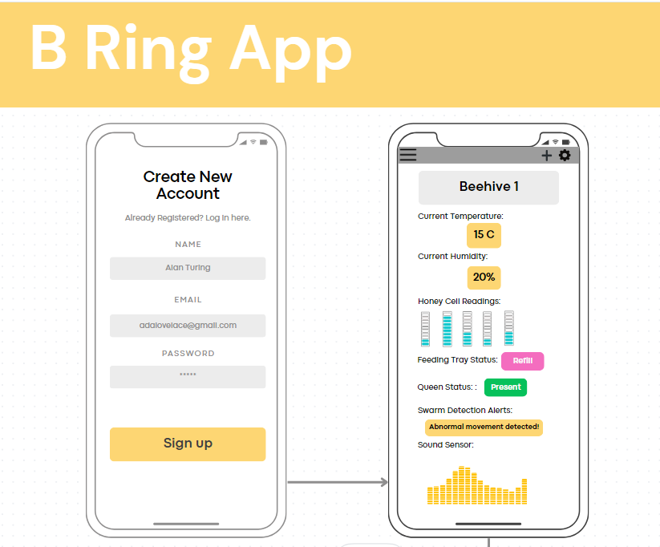

> Product Requirements Document (PRD)
>
> [Problem Description]{.underline}\
> [Scope]{.underline}\
> [Use Cases]{.underline}\
> [Purpose and Vision (Background)]{.underline}\
> [Stakeholders]{.underline}\
> [Preliminary Context]{.underline}\
> [Assumptions]{.underline}\
> [Constraints]{.underline}\
> [Dependencies]{.underline}\
> [Market Assessment and Competition Analysis]{.underline}\
> [Target Demographics (User Persona)]{.underline}\
> [Requirements]{.underline}\
> [User Stories and Features (Functional Requirements)]{.underline}\
> [Non-Functional Requirements]{.underline}\
> [Data Requirements]{.underline}\
> [Integration Requirements]{.underline}\
> [User Interaction and Design]{.underline}\
> [Milestones and Timeline]{.underline}\
> [Goals and Success Metrics]{.underline}\
> [Open Questions]{.underline}\
> [Out of Scope]{.underline}\
> [References]{.underline}
>
> **Problem Description**
>
> Current beekeeping methods are lacking in technological innovation.
> Because of climate change, parasites, pesticides, and starvation, 48
> percent of honeybee colonies in America were lost in the past year,
> the second highest death toll on record (Borenstein, 2023).
>
> Beekeepers are struggling to prevent a parasitic mite called Varroa
> from infesting these hives, and they don't have easy access to hive
> data in order to identify an early\
> infestation. With climate change, unnatural warm spots in the winter
> have brought bees out of hibernation early, which means beekeepers
> need to constantly track and manage hive temperature and humidity,
> usually with a manual probe. If bees leave hibernation early, they
> will starve to death from a lack of pollen from flowering plants. We
> rely on bees to provide for 80 percent of pollination for
> insect-pollinated plants, so a loss of pollination would devastate the
> agricultural industry (Randall, 2022). Beekeepers need easier and
>
> more efficient technology to address the losses beekeepers are facing
> in these trying times.
>
> **Scope**
>
> The scope for this product will be limited to UI development, as an
> automation and robotics company is working on the backend and robotics
> functionality. We are currently at the\
> prototyping phase with the Bee-Ring, so the UI should be focused on
> delivering basic app functionality and data for the frontend. This
> means storing and providing the data in an easy and accessible manner,
> and designing an intuitive UI interface. The goal is to manage
> real-time hive data in order to catch any health problems early on.
> This helps beekeepers keep their bees healthy, without dealing
> directly with a mountain of data. Additionally, there is a difference
> between hobby beekeeping and industrial beekeeping, with industrial
> beekeeping being at a much larger scale. With this in mind, this
> project is focusing exclusively on hobby beekeeping for now, but for
> future iterations, our project partner wants to include versions for
> industrial beekeeping and beekeeping research.
>
> **Use Cases**
>
> **Early Disease Detection**
>
> [Use Case]{.underline}: A beekeeper receives a notification on their
> smartphone when the monitoring system detects unusual temperature
> changes in a hive. This allows the beekeeper to investigate and
> address potential health issues, possibly preventing the spread of
> diseases within the colony.
>
> **Optimal Hive Environment**
>
> [Use Case]{.underline}: A beekeeper uses the system to maintain the
> right environmental conditions in the hives, especially during bad
> weather conditions. The monitoring system automatically adjusts
> temperature and humidity levels, ensuring the health of the colony.
> This stability leads to increased pollination rates and better honey
> production.
>
> **Remote Hive Monitoring and Management**
>
> [Use Case]{.underline}: Beekeepers, with hives in various locations,
> remotely monitor all their hives through a centralized dashboard. This
> enables prompt issue identification and potential resolution from a
> distance, ensuring the health of bee colonies without the need for
> frequent on-site visits.
>
> [Use Case]{.underline}: The user will check their beehive statistics
> through the app and see trends over a certain period of time such as
> changes in temperature or humidity.
>
> [Use Case]{.underline}: The user checks the health of their hive while
> they are at work. They see that the humidity of the hive is lower than
> optimal. They make an adjustment on the app to raise the humidity of
> the hive.
>
> **Efficient Hive Inspections**
>
> [Use Case]{.underline}: Beekeepers can remotely access hive data to
> make informed decisions about hive management. For example, they
> schedule inspections only when the system detects problems, reducing
> disruptions to the bees, saving time, and optimizing how resources are
> used.
>
> [Use Case]{.underline}: The user will be able to check on the queen
> bee status to see whether she is missing or present.
>
> [Use Case]{.underline}: The user will be able to see whether they need
> to refill the feeding trays.
>
> **Bee Ring Device Management**
>
> [Use Case]{.underline}: The user will access their settings on the app
> and select which specific notifications they want on beehive activity.
>
> [Use Case]{.underline}: The user will access their settings on the app
> and select the thresholds for certain notifications (i.e. temperature
> min and max, humidity min and max, etc).
>
> [Use Case]{.underline}: The user will add beehives with a Bee-Ring to
> the app so they can view the statuses for multiple bee hives via
> bluetooth connection.
>
> [Use Case]{.underline}: The user will set and track hive management
> goals through the Hive Management tab.
>
> **Purpose and Vision (Background)**
>
> Our purpose is to develop a beekeeping app that provides users with
> data on the health and productivity of their hives in real time so
> that users can improve beehive conditions and monitor changes over
> time.
>
> We want beekeepers to use our product for current and future hives; as
> more users interact with this product, more bees are saved.
>
> Currently, beekeepers are struggling with excessive hive losses every
> year, due to climate change, parasites, pesticides, and starvation.
> With the right data, some of these problems can be prevented with
> early detection of abnormalities in the hive. As it stands, beekeepers
> don't have easy access to preventative technologies.
>
> The Bee Ring wants to make beekeeping easy and effective, especially
> for small-scale beekeepers facing challenges due to declining bee
> populations. We want to simplify hive management by using smart
> technology. Our vision is to empower beekeepers with a user-friendly
> tool that manages hive data and prevents health issues early on. The
> Bee Ring is designed for beekeepers who are passionate about their
> hives but struggle with the
>
> complexities of hive management. Our vision is to empower beekeepers
> with a tool that takes care of the details, so they can enjoy
> beekeeping without the stress.
>
> While our focus is on making beekeeping easier for small-scale
> beekeepers, this project intends to lay the groundwork for future
> expansion, envisioning the evolution of the Bee-Ring into a
> comprehensive solution tailored for large-scale commercial beekeeping.
> We intend to support the diverse needs of all beekeepers, from
> hobbyists to industry professionals, and make the Bee-Ring a valuable
> tool in beekeeping of all scales.
>
> **Stakeholders**

+-----------------------------------+-----------------------------------+
| > ●\                              | > Users\                          |
| > ●\                              | > Manufacturers\                  |
| > ●\                              | > Founders\                       |
| > ●                               | > Engineering Team                |
+===================================+===================================+
+-----------------------------------+-----------------------------------+

> **Beekeepers (Users)**:\
> [Update Frequency]{.underline}: Regular, especially during hive
> inspections and problem detection. [Type of Updates]{.underline}:
> Real-time data on hive conditions, alerts for issues.
>
> [Decision-Makers]{.underline}: Main decision-makers regarding hive
> management.
>
> [Decisions]{.underline}: Adoption of the Bee-Ring system, implementing
> automation.
>
> [Requirements]{.underline}: Detailed, real-time hive data for informed
> decisions.
>
> **Beekeeping Product Manufacturers**:\
> [Update Frequency]{.underline}: Regular for marketing materials.
>
> [Type of Updates]{.underline}: Product descriptions, promotional
> content.\
> [Decision-Makers]{.underline}: Marketing Managers.
>
> [Decisions]{.underline}: Marketing strategies and campaigns.
>
> [Requirements]{.underline}: Data on the Bee-Ring\'s unique selling
> points.
>
> **Preliminary Context**
>
> **Assumptions**
>
> We can develop an app that works across all mobile platforms (iOS,
> Android).
>
> We can acquire pseudo-data in the format that will be provided by the
> device hardware for testing
>
> Libraries used for development are reliable and without bugs
>
> [Data Sorting Feasibility]{.underline}: We assume that the vast amount
> of data generated by the bee monitoring sensors can be effectively
> sorted and analyzed using appropriate sensors and software,
> considering the data\'s complexity and volume.
>
> [Beekeeper Adaptability]{.underline}: We assume that beekeepers, who
> traditionally rely on manual methods, can readily adapt to data-driven
> techniques and incorporate the technology into their\
> beekeeping practices.
>
> [Cross-Platform Implementation]{.underline}: We assume that the
> monitoring algorithms developed for the project can be efficiently
> implemented on various platforms, including iOS, Android, and PC, to
> cater to a wide range of users and their preferred devices.
>
> [Availability of Open Source Sensor Libraries]{.underline}: We assume
> that open-source libraries and resources for bee monitoring sensors
> and related technologies are accessible and readily obtainable to
> support the project\'s sensor technology needs.
>
> [Sensor Data Accuracy]{.underline}: We assume that the sensor data
> collected will be accurate and reliable for monitoring bee behavior,
> hive conditions, and environmental factors, considering the critical
> nature of the data for informed decision-making.
>
> [Bee Health and Behavior Consistency]{.underline}: We assume that the
> behavior and health patterns of bees remain relatively consistent,
> allowing the monitoring algorithms to detect anomalies and health
> issues effectively.
>
> **Constraints**
>
> As a smaller team, we need to achieve basic functionality within 6
> months for testing
>
> We need to make sure that our frontend is compatible with the backend.
>
> We need to make sure that there is no chance the software will have a
> fatal malfunction as the life of the hive is on the line.
>
> We need reliable communication with our project partner to make
> necessary changes.
>
> [Deadline Constraints]{.underline}: There are tight project deadlines
> in place to bring the product to market by spring 2024. Keeping to
> these time constraints is essential to meet market demand and business
> goals. The project faces time constraints due to the involvement of
> students who may have limited availability outside of academic
> commitments.
>
> [Adoptability Constraints]{.underline}: Traditional beekeepers may be
> resistant to adopting new, data-driven beekeeping methods. The project
> must address the challenge of convincing beekeepers to embrace this
> technological change and provide resources and support for a smooth
> transition.
>
> [Budgetary Constraints]{.underline}: The project operates within
> specific budgetary constraints that limit expenditures for research,
> development, and production. Effective resource management is crucial
> to stay within budget and achieve the project\'s financial goals.
>
> [Resource and Expertise Constraints]{.underline}: The project may face
> constraints related to the availability of skilled staff and expertise
> in areas such as sensor technology, data analysis, and software
> development. Maximizing the effective use of available resources and
> expertise is essential.
>
> **Dependencies**
>
> We're dependent on getting more information from our project partner
> in order to proceed with this project.
>
> We're dependent on the structure of the backend for compatibility with
> our frontend.
>
> We're dependent on the reliability of the hardware sensors to give the
> front end reliable, accurate data.
>
> We need access to the database for all of the variables we are
> tracking with the hardware.
>
> [Testing and Development by Independent Beekeepers]{.underline}: The
> project may rely on the active participation of independent beekeepers
> who serve as testers and contributors to further develop the product.
> Feedback and insights from beekeepers are essential for refining the
> technology.
>
> [Sequential Tasks in Product Development]{.underline}: The project\'s
> development process involves various sequential tasks, from sensor
> implementation to software integration. These tasks need to be
> completed in a specific order, and delays in any one of them can
> affect the overall project timeline.
>
> **Market Assessment and Competition**
>
> **Analysis**
>
> Alternatives (Wutke, 2023):
>
> ● Gobuzzr is a beehive monitoring system that uses sensors and an app
> to provide instant notifications about temperature changes, weight, or
> humidity levels. They do not monitor bee behaviors, hive activity, or
> honey production\
> ● Beebot tracks temperature, humidity, and bee's buzzing for changes.
> Again, they do not monitor bee behaviors, hive activity, or honey
> production\
> ●\
> Apple Air tag can be used to monitor theft with GPS location of the
> hives, but it does not provide any features for beekeepers
> specifically
>
> The Bee-Ring appears to be an upgraded version of what is currently
> available on the market.
>
> Tracking temperature and humidity using wireless hardware seems to be
> a popular technological advancement in the beekeeping industry.
> However, these devices have yet to monitor bee behaviors, hive
> activity, or honey production, which are unique features to the
> Bee-Ring.
>
> **Target Demographics (User Persona)**
>
> There are a few personas we can make based on the specific needs of
> each hobby beekeeper
>
> ● Sydney is a 31 y.o. hobby beekeeper that has struggled with the
> temperature changes in her state. She is currently using an oven
> thermometer to measure the temperature every day at 8 am.
>
> ● David is a 25 y.o. hobby beekeeper that has lost an entire hive to
> Varroa mites. The pupae died and the survivors were left with wing
> deformities and cognitive impairment.
>
> Monica is a 60 y.o. hobby beekeeper. She is currently retired and her
> passion is taking●\
> care of her bees, and she has been very successful.
>
> ● John is a 40 y.o. hobbyist beekeeper that has 5 hives. He sells his
> honey locally for supplemental income and has a full time job.
>
> ● Jessica is a 65 y.o. recent retiree. She just started learning about
> beekeeping and wants to start her own hive within the next month.
>
> **Requirements**
>
> **User Stories and Features (Functional Requirements)**

+-------------+-------------+-------------+-------------+-------------+
| **User      | **Feature** | *           | **GitHub    | **Dep       |
| Story**     |             | *Priority** | Issue**     | endencies** |
+=============+=============+=============+=============+=============+
| > As a      | > TBD       | > Must Have | > TBD       | > N/A       |
| >           |             |             |             |             |
|  beekeeper, |             |             |             |             |
| > I want to |             |             |             |             |
| > be able   |             |             |             |             |
| > to check  |             |             |             |             |
| > the       |             |             |             |             |
| >           |             |             |             |             |
| temperature |             |             |             |             |
| > and       |             |             |             |             |
| > humidity  |             |             |             |             |
| > of my     |             |             |             |             |
| > hives     |             |             |             |             |
| > when I am |             |             |             |             |
| > unable to |             |             |             |             |
| > check\    |             |             |             |             |
| > manually. |             |             |             |             |
+-------------+-------------+-------------+-------------+-------------+
| > As a      | > TBD       | > Must Have | > TBD       | > N/A       |
| >           |             |             |             |             |
|  beekeeper, |             |             |             |             |
| > I want to |             |             |             |             |
| > be able   |             |             |             |             |
| > to look   |             |             |             |             |
| > at        |             |             |             |             |
| > previous  |             |             |             |             |
| >           |             |             |             |             |
| temperature |             |             |             |             |
| > and       |             |             |             |             |
| > humidity  |             |             |             |             |
| >           |             |             |             |             |
|  statistics |             |             |             |             |
| > to see if |             |             |             |             |
| > there is  |             |             |             |             |
| > a growing |             |             |             |             |
| >           |             |             |             |             |
| abnormality |             |             |             |             |
| > with      |             |             |             |             |
| > either    |             |             |             |             |
| > variable  |             |             |             |             |
| > over      |             |             |             |             |
| > time.     |             |             |             |             |
+-------------+-------------+-------------+-------------+-------------+
| > As a      | > TBD       | > Must Have | > TBD       | > N/A       |
| >           |             |             |             |             |
|  beekeeper, |             |             |             |             |
| > I want to |             |             |             |             |
| > receive   |             |             |             |             |
| > no        |             |             |             |             |
| tifications |             |             |             |             |
| > of any    |             |             |             |             |
| >           |             |             |             |             |
| significant |             |             |             |             |
| > changes   |             |             |             |             |
| > to my     |             |             |             |             |
| > beehive.  |             |             |             |             |
+-------------+-------------+-------------+-------------+-------------+

+-------------+-------------+-------------+-------------+-------------+
| > As a      | > The       | > Will not  | > N/A       | > Remote    |
| > user, I   | > product   | > have      |             | > control   |
| > don\'t    | > will not\ |             |             | > may have\ |
| > require   | > include\  |             |             | > safety    |
| > the       | > features  |             |             | > and\      |
| > ability   | > for       |             |             | >           |
| > to        | > remote\   |             |             | regulatory\ |
| > control   | > control   |             |             | > concerns, |
| > all hive  | > of\       |             |             | > and it    |
| > equipment | > most      |             |             | > falls     |
| > remotely. | > hive\     |             |             | > outside\  |
|             | >           |             |             | > the       |
|             |  equipment. |             |             | > primary\  |
|             |             |             |             | >           |
|             |             |             |             |  monitoring |
|             |             |             |             | > and data  |
|             |             |             |             | > analysis\ |
|             |             |             |             | > focus.    |
+=============+=============+=============+=============+=============+
| > As a      | > The       | > Will Not  | > N/A       | >           |
| > user,     | > system    | > have      |             | E-commerce\ |
| > I\'m not  | > will not  |             |             | > fun       |
| > looking   | > offer     |             |             | ctionality\ |
| > for       | >           |             |             | > falls     |
| > support   |  e-commerce |             |             | > outside   |
| > for       | > features\ |             |             | > the scope |
| > h         | > related   |             |             | > of hive\  |
| ive-related | > to\       |             |             | > data      |
| >           | > hive\     |             |             | >           |
|  e-commerce | > products  |             |             |  collection |
| >           |             |             |             | > and       |
|  functions. |             |             |             | > analysis  |
+-------------+-------------+-------------+-------------+-------------+

> **Non-Functional Requirements**
>
> ● The system should recover from a failure within 5 minutes without
> past data loss. Cannot store real-time data while offline\
> ● The product should be accessible 24/7 except during scheduled
> maintenance windows● The product should work on any mobile device with
> any screen size\
> ●\
> Code should have documentation on how to maneuver the app. Include
> standardized commenting and step-by-step instructions\
> ● The app must be connected to the device at all times to provide
> real-time data and accurate statistics\
> ● Data must be protected and comply with regulations
>
> **Data Requirements**

+-----------------------------------+-----------------------------------+
| > ●\                              | > Temperature readings\           |
| > ●\                              | > Humidity readings\              |
| > ●\                              | > Brood patterns\                 |
| > ●\                              | > Honey production\               |
| > ●                               | > Bee behavior                    |
+===================================+===================================+
+-----------------------------------+-----------------------------------+

> **Hive Information**:\
> [Data Structure]{.underline}: JSON or XML
>
> [Details]{.underline}: Hive ID, location, date of setup, hive type,
> owner information, and current status (active or inactive).
>
> **Bee Behavior Data**:\
> [Data Structure]{.underline}: CSV\
> [Details]{.underline}: Behavior logs with timestamps, hive ID, and
> descriptions of bee behaviors such as foraging, swarming, comb
> building, and brood care.
>
> **Hive Health Data**:\
> [Data Structure]{.underline}: JSON or XML\
> [Details]{.underline}: Records of hive health indicators, including
> disease prevalence, pest infestations, colony strength, honey
> production, and queen activity.
>
> **User Data**:\
> [Data Structure]{.underline}: Relational Database (such as MySQL)\
> [Details]{.underline}: User profiles with personal information, login
> credentials, hive ownership, and notification preferences.
>
> **Sensor Calibration Data**:\
> [Data Structure]{.underline}: JSON or XML\
> [Details]{.underline}: Information about sensor calibration, including
> calibration coefficients and calibration timestamps. Used to ensure
> data accuracy.
>
> **Notification Data**:\
> [Data Structure]{.underline}: JSON or XML\
> [Details]{.underline}: Records of notifications sent to users,
> including message content, recipient ID, timestamp, and delivery
> status.
>
> **Logs and Metadata**:\
> [Data Structure]{.underline}: JSON or XML\
> [Log Files Details]{.underline}: System logs and metadata, including
> system events, errors, user activities, and API requests. Timestamps
> and log levels for debugging and auditing.
>
> **Backup Data**:\
> [Data Structure]{.underline}: Encrypted Database Backup\
> [Details]{.underline}: Encrypted backups of all critical data to
> ensure data recovery and integrity in case of system failure.
>
> **Integration Requirements**
>
> The product needs to connect with the physical device that is
> monitoring the beehive. The app needs to receive all data requirements
> from the device, and store that data for the user to see through the
> app. We also need to integrate our frontend with the backend design.
>
> **Functional Integration Requirements**
>
> **User Notification Service:**\
> [Integration Point]{.underline}: A Notification Module.
>
> [Functionality]{.underline}**:** Sends real-time notifications to
> users based on hive data and events. [Requirements]{.underline}:
> Immediate and reliable notification delivery with options for user
> preferences.
>
> **Hive Health Analysis Module:**\
> [Integration Point]{.underline}: Internal Data Analysis Module and
> external Data analysis API.
>
> [Functionality]{.underline}: Analyzes hive health data and provides
> health reports to beekeepers.
>
> [Requirements]{.underline}: Fast and accurate data processing with the
> possibility to generate insights and recommendations.
>
> **Behavior Pattern Recognition:**\
> [Integration Point]{.underline}: Internal Machine Learning Module or
> API.
>
> [Functionality]{.underline}: Identifies and logs bee behavior patterns
> from sensor data.
>
> [Requirements]{.underline}: Real-time pattern recognition, with
> continuous learning and pattern refinement.
>
> **Non-Functional Integration Requirements**
>
> **Security and Authentication:**\
> [Integration Point]{.underline}**:** User Data Management Module\
> [Requirements]{.underline}: Secure authentication and access control
> to protect user data.
>
> **Performance Monitoring:**\
> [Integration Point]{.underline}**:** System Logging and Monitoring
> Module or external API\
> [Requirements]{.underline}: Constant system monitoring for
> performance, errors, and real-time alerts
>
> **User Interaction and Design**
>
> Current mockups need to be discussed with our project partner. We
> currently have a couple of mockups in the works, as shown below:
>
> {width="6.031944444444444in"
> height="4.988888888888889in"}
>
> The layout could first be based on a website style design that works a
> bit like the canvas interface. This could then be adapted to work as a
> phone app or be expanded into a complete software product. The basic
> design could be built around a dashboard that abstracts the feature as
> cards.
>
> **Dashboard Mockup**:\
> The dashboard is the central hub where users can quickly access
> critical hive data immediately. The design should focus on simplicity,
> clarity, and intuitive data visualization.
>
> [Interactions]{.underline}: Users can interact with widgets displaying
> hive status, environmental/weather conditions, and notifications. They
> can also set preferences for the display of data.
>
> [Mockup Description]{.underline}: A clean and organized dashboard
> featuring real-time data cards for each hive, weather updates, and
> notifications. Users can click on a hive card for detailed
> information.
>
> **Hive Detail Page**:\
> When a user clicks on a hive from the dashboard, they should be
> presented with a detailed view that offers in depth information about
> that hive\'s health and activity.
>
> [Interactions]{.underline}: Users can scroll through historical data
> charts, view sensor data, and access hive-specific settings.
>
> [Mockup Description]{.underline}: The hive detail page includes line
> charts showing temperature and humidity trends, images from the
> hive\'s camera, and buttons for settings adjustments.
>
> **Notification Center**:\
> Notifications are crucial for real-time alerts. The notification
> center should provide a straightforward way to view and manage alerts.
>
> [Interactions]{.underline}: Like an email system, users can see
> notifications categorized by importance, mark them as read, or
> possibly take specific actions in response to alerts.
>
> [Mockup Description]{.underline}: The notification center displays
> notifications with time stamps, and users can mark them as read,
> dismiss them, or click to see more details.
>
> **Settings Panel**:\
> For changing settings or user preferences, the settings panel should
> be user-friendly.
>
> [Interactions]{.underline}: Users can customize notification
> preferences, sensor calibration, and connectivity settings.
>
> [Mockup Description]{.underline}: A clean settings panel with tabs for
> general preferences, notifications, sensor settings, and connectivity
> options.
>
> **Milestones and Timeline**
>
> The planning and researching phase will occur this term until Week 7
> or Week 8. Then we proceed to start working on certain features
> throughout the winter term, and then do testing in the spring. With
> dates, this would be the tentative timeline:

+-----------------------+-----------------------+-----------------------+
| ●                     | > Planning/Research:  |                       |
|                       |                       |                       |
| ●                     |                       |                       |
|                       |                       |                       |
| ●                     |                       |                       |
|                       |                       |                       |
| ●                     |                       |                       |
|                       |                       |                       |
| ●                     |                       |                       |
+=======================+=======================+=======================+
|                       | ○                     | > Start: October 1st  |
+-----------------------+-----------------------+-----------------------+
|                       | ○                     | > End: November 20th  |
+-----------------------+-----------------------+-----------------------+
|                       | > Milestone:          |                       |
|                       | > Completed Research! |                       |
|                       | >                     |                       |
|                       | > F                   |                       |
|                       | unctionality/Features |                       |
|                       | > Development:        |                       |
+-----------------------+-----------------------+-----------------------+
|                       | ○                     | > Start: November     |
|                       |                       | > 21st                |
+-----------------------+-----------------------+-----------------------+
|                       | ○                     | > End: March 22nd     |
+-----------------------+-----------------------+-----------------------+
|                       | > Milestone:          |                       |
|                       | > Completed basic     |                       |
|                       | > functionality and   |                       |
|                       | > features! Testing:  |                       |
+-----------------------+-----------------------+-----------------------+
|                       | ○                     | > Start: April 1st    |
+-----------------------+-----------------------+-----------------------+
|                       | ○                     | > End: June 7th       |
+-----------------------+-----------------------+-----------------------+

+-----------------------------------+-----------------------------------+
| ●                                 | > Milestone: Completed testing!   |
+===================================+===================================+
+-----------------------------------+-----------------------------------+

> **Detailed Milestones**:\
> [Milestone 1]{.underline}: Project Setup (1-2 weeks)

+-----------------------------------+-----------------------------------+
| > •\                              | > Define project scope and        |
| > •\                              | > requirements.                   |
| > •\                              | >                                 |
| > •                               | > Gather necessary resources and  |
|                                   | > tools.                          |
|                                   | >                                 |
|                                   | > Set up the development          |
|                                   | > environment.                    |
|                                   | >                                 |
|                                   | > Create project repository and   |
|                                   | > initial documentation.          |
+===================================+===================================+
+-----------------------------------+-----------------------------------+

> [Milestone 2a]{.underline}: User Dashboard (4-6 weeks)
>
> • Display real-time hive data, including temperature, humidity, and
> status.
>
> • Implement data visualization and analytics tools.
>
> • User story: \"As a beekeeper, I want to access a dashboard to
> monitor the status of my hives and analyze collected data.\"
>
> [Milestone 2b]{.underline}: Data Collection (4-6 weeks)
>
> • Create data structures and APIs for storing hive data.
>
> • Implement real-time data collection from hive sensors and Store
> collected data in a database.
>
> • User story: \"As a beekeeper, I want to collect data from hive
> sensors in real-time for analysis.\" (Milestone 2a and 2b should
> happen concurrently)
>
> [Milestone 3]{.underline}: Automated Notifications (3-4 weeks)

+-----------------------------------+-----------------------------------+
| > •\                              | > Implement an automated          |
| > •\                              | > notification system for         |
| > •\                              | > important hive events.          |
| > •                               | >                                 |
|                                   | > Set up alerts for temperature   |
|                                   | > or humidity deviations.         |
|                                   | >                                 |
|                                   | > Send notifications to           |
|                                   | > beekeepers via email or mobile  |
|                                   | > app.                            |
|                                   | >                                 |
|                                   | > User story: \"As a beekeeper, I |
|                                   | > want to receive notifications   |
|                                   | > when hive conditions require    |
+===================================+===================================+
+-----------------------------------+-----------------------------------+

> my attention.\"
>
> [Milestone 4]{.underline}: Scalability and Performance Optimization
> (3-4 weeks)

+-----------------------------------+-----------------------------------+
| > •\                              | > Optimize the system for         |
| > •\                              | > scalability to handle a growing |
| > •\                              | > number of hives. Enhance system |
| > •                               | > performance for real-time data  |
|                                   | > processing.                     |
|                                   | >                                 |
|                                   | > Perform load testing and        |
|                                   | > optimization.                   |
|                                   | >                                 |
|                                   | > User story: \"As a large-scale  |
|                                   | > beekeeper, I want a system that |
|                                   | > can scale with my               |
+===================================+===================================+
+-----------------------------------+-----------------------------------+

> expanding honey production.\"
>
> [Milestone 5]{.underline}: Documentation and Testing (2-3 weeks)

+-----------------------------------+-----------------------------------+
| > •\                              | > Create user guides and          |
| > •\                              | > developer documentation.        |
| > •\                              | >                                 |
| > •                               | > Conduct thorough testing,       |
|                                   | > including unit, integration,    |
|                                   | > and user acceptance testing.    |
|                                   | > Address any bugs or issues      |
|                                   | > identified during testing.      |
|                                   | >                                 |
|                                   | > User story: \"As a user, I want |
|                                   | > clear documentation for using   |
|                                   | > the system effectively.\"       |
+===================================+===================================+
+-----------------------------------+-----------------------------------+

> [Milestone 6]{.underline}: Deployment and User Training (2-3 weeks)

+-----------------------------------+-----------------------------------+
| > •\                              | > Prepare for the product launch. |
| > •\                              | >                                 |
| > •\                              | > Deploy the system to            |
| > •                               | > production.                     |
|                                   | >                                 |
|                                   | > Provide training and support to |
|                                   | > users.                          |
|                                   | >                                 |
|                                   | > User story: \"As a beekeeper, I |
|                                   | > want training to effectively    |
|                                   | > use the system.\"               |
+===================================+===================================+
+-----------------------------------+-----------------------------------+

> **Goals and Success Metrics**

+-------------+-------------+-------------+-------------+-------------+
| **Goal**    | **Metric**  | *           | **Target**  | **Tracking  |
|             |             | *Baseline** |             | Method**    |
+=============+=============+=============+=============+=============+
| > Maintain  | Error       | > 8% at the | > 4% at the | > Plausible |
| > accurate  | margin for  | > 95%\      | > 95%\      | > Analytics |
| >           | measuring   | >           | >           |             |
|  statistics | temperature |  confidence |  confidence |             |
|             | and         | > level.    | > level.    |             |
|             | humidity.   |             |             |             |
+-------------+-------------+-------------+-------------+-------------+
| > Pro       | > On a      | > Not hard  | > Very hard | > Interview |
| duct-market | > scale of  | > \< 4      | > \> 4      |             |
| > fit       | > 1-10, how |             |             |             |
|             | > hard is   |             |             |             |
|             | > it to     |             |             |             |
|             | > maintain  |             |             |             |
|             | > a healthy |             |             |             |
|             | > hive\     |             |             |             |
|             | >           |             |             |             |
|             | environment |             |             |             |
|             | > for       |             |             |             |
|             | > hobby\    |             |             |             |
|             | >           |             |             |             |
|             | beekeeping? |             |             |             |
+-------------+-------------+-------------+-------------+-------------+
| > Increase  | > \% of pre | > 100%      | > 75%       | > User      |
| > free time | > Bee Ring  |             |             | > survey    |
| > of the    | > time      |             |             |             |
| > user      | > spent     |             |             |             |
|             | > caring    |             |             |             |
|             | > for their |             |             |             |
|             | > hive.     |             |             |             |
+-------------+-------------+-------------+-------------+-------------+

> **Open Questions**
>
> What programming language(s) is being used to program the backend?
>
> What is the timeline of this project?
>
> What are the requirements that are absolutely necessary for this
> project, and what are stretch goals?
>
> What is the ideal final product?
>
> **Out of Scope**
>
> The hardware is still in development, so we will not be testing the
> frontend with these\
> components for either the entirety of the project or the second half
> depending on what our project partner says. We should also stress that
> this is not a final product, we are creating a V1 of the UI, which
> means after project completion, changes may occur by future engineers.
>
> **References**
>
> Borenstein, S. (2023, June 22). *Struggling beekeepers stabilize U.S.
> honeybee population after nearly half of colonies died last year*.
> PBS.
>
> https://www.pbs.org/newshour/economy/struggling-beekeepers-stabilize-u-s-honeybee-populati
> on-after-nearly-half-of-colonies-died-last-year
>
> Randall, B. (2022, June 6). *The Value of Birds and Bees*.
> Farmers.gov.
>
> https://www.farmers.gov/blog/value-birds-and-bees#:\~:text=Honey%20bees%20alone%20pollin
> ate%2080,types%20of%20fruits%20and%20vegetables.
>
> Wutke, S. (2023, July 17). *Bee smarter about beekeeping with Smart
> Devices*. Hobby Farms.
> https://www.hobbyfarms.com/bee-smarter-about-beekeeping-with-smart-devices/
