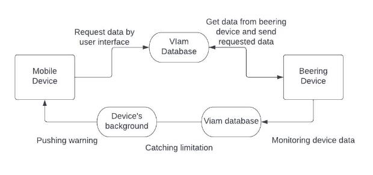

Software Design and Architecture

[Introduction](#_page0_x72.00_y357.56)

[Architectural Goals and Principles ](#_page0_x72.00_y642.75)[System Overview](#_page1_x72.00_y581.12)

[Architectural Patterns ](#_page2_x72.00_y296.28)[Component Descriptions](#_page3_x72.00_y130.19)

[Data Management](#_page3_x72.00_y546.29)

[Interface Design](#_page4_x72.00_y581.12)

[Considerations](#_page5_x72.00_y72.00)

[Security](#_page5_x72.00_y104.45)

[Performance](#_page5_x72.00_y172.70)

[Maintenance and Support ](#_page5_x72.00_y232.40)[Deployment Strategy](#_page5_x72.00_y321.20)

[Testing Strategy](#_page6_x72.00_y130.19)

[Glossary](#_page6_x72.00_y633.57)

Introduction

The document outlines the architecture for a phone app-based hobby beekeeping application. A well-defined architecture ensures scalability, maintainability, and reliability. Our goal is to create the first version of our project’s frontend. With this in mind, we need to create an architectural design that is intuitive for future programmers who will provide maintenance and support to future versions of our application. A good architectural design ensures easier debugging and maintenance.

**Project Objectives**

- The core objectives of the B-Ring project are as follows:
- Develop a user-friendly mobile Android app for beekeepers to monitor hive conditions, bee behavior, and environmental factors in real-time.
- Implement a scalable backend system capable of collecting, storing, and processing hive-related data efficiently, serving multiple users simultaneously.
- Enable automated notifications for beekeepers, alerting them to critical hive events and optimal honey collection conditions.
- Maintain data privacy and compliance with relevant data protection regulations.

Architectural Goals and Principles

**Architectural Goals:**

- **Scalability:** The architecture must be designed to support an increasing number of users and beekeeping devices, ensuring that the system can accommodate both small-scale and large-scale beekeepers.
- **Real-time Data Processing:** The system should provide real-time data collection and analysis capabilities, with a delay of no more than 5 seconds from the moment of data acquisition.
- **Data Security:** All data communication must be encrypted to protect data privacy and integrity. User authentication and authorization should be implemented securely.
- **Usability and User Experience:** The architecture should prioritize user-friendliness and provide an easy to use interface with a high standard of accessibility.
- **Data Privacy and Compliance:** The system should adhere to relevant data protection regulations, providing clear data usage policies for users.
- **Performance and Reliability:** The architecture must ensure a smooth and responsive user experience. The system should be available 24/7, with minimal downtime.

**Architectural Principles:**

- **Modularity:** The architecture should be composed of loosely coupled, interchangeable modules that can be independently developed, tested, and maintained.
- **API-First Approach:** Utilize Flutter's well-defined API that separates the frontend from the backend, allowing for easier integration.
- **Documentation and Best Practices:** Adhere to strict coding standards and best practices, with well-documented code and a comprehensive user guide to support maintainability and collaboration.
- **Performance Optimization:** Monitor and optimize system performance to deliver a responsive and efficient user experience, even as the system scales to accommodate more users and beehives.
- **Data-Driven Insights:** Use data for analytics and research, empowering beekeepers with tools to gain valuable insights into bee health.
- **Don’t Repeat Yourself (DRY):** If we duplicate logic and we need to change behavior, we will encounter inconsistent behavior from the system. To ensure we don’t have these problems that compromise reliability, we will encapsulate our logic in a programming construct, thus reducing the repetition in logic and ensuring that our system is reliable.
- **Single Responsibility:** Our objects should only have one responsibility, and thus are only subjected to change when that responsibility needs to change. This simplifies our code to be as efficient as possible while also making it easy for version changes.

System Overview

User interface will be built and packaged with Flutter using Dart language, and Flutter makes the application for the IOS and Android environment at the same time. API will be set up with Dart since the Viam Database and Server can provide data in the Dart environment.

Architectural Patterns

There are three different architectural patterns that would be ideal for this project: The client-server pattern, event-sourcing pattern, and controller-responder pattern.

**Client-Server Pattern:**

The client-server pattern is well-suited for scenarios where there is a need for centralized data management and control, making it an ideal choice for B-Ring. Beehive data, user profiles, sensor calibration, and notification records are vital components that need centralized management.

**Event-Sourcing Pattern:**

An event sourcing pattern is good for applications that use real-time data. The B Ring uses real-time data to report anomalies in temperature, humidity, and bee behavior, so this architectural pattern caters to that requirement.

**Controller-Responder Pattern:**

The controller-responder pattern introduces an additional layer in the architecture, where the controller handles data and workloads, while the responder replicates data from the controller and generates results. This pattern provides a level of data separation and redundancy. The controller-responder pattern ensures data integrity and minimizes data loss in case of controller failures. It would also be good for our project because we already have a controller component from our project partner, since we don’t need to create the database from scratch. We only need to create the responder to generate results for the user-based app.

Both have their pros and cons. Event-sourcing requires a reliable network infrastructure, which we are not guaranteed to have, and the controller may cause a loss of data if it fails. This merits a discussion in the future.

Component Descriptions

- **User Interface (UI) - Flutter:**
- Responsibilities: Manages user interactions, displays real-time hive data, and provides a user-friendly interface for beekeepers and environmental enthusiasts.
- Role: The UI is the front-end component responsible for rendering the mobile app's graphical interface, allowing users to monitor hive conditions, receive notifications, and interact with the system.
- **Backend Server - Viam:**
- Responsibilities: Processes API requests, handles business logic, manages hive data, user profiles, and authentication, and interacts with the database (stored in JSON files).
- Role: The backend server serves as the core of the system, managing user authentication, realtime data collection, and processing. It ensures the security and integrity of hive data and delivers data to the UI via APIs.
- **Database - Firebase:**
- Responsibilities: Stores and manages hive information, environmental data, user profiles, and system logs.
- Role: The database component manages the persistence of crucial data, including hive setup details, real-time sensor data, and user accounts. It serves as a centralized data repository for the system.
- **B Ring Hardware:**
- Responsibilities: provides beekeeping footage and physical data collection to server
- Role: The hardware is the setup for all of the sensors and video footage; it is the physical essence of the B Ring. All other components of the system rely on the hardware for accurate sensor measurements and video analysis.

Data Management

Data will be stored and able to be accessed through the B Rings Viam backend with the Dart programming language. This means that the database is already set up, and we just need to access the data from the frontend to display to the user. We have yet to receive access for this code, so we don’t know what the current database looks like. After we get access to the current program, we can learn how to access the data for user consumption. Their service has data management built into it, allowing users to capture, sync, view, label, and export data.

Through Viam we will use the following Data Management Plan:

**User Profiles:**

- Fields: User ID, username, password (hashed), email, notification preferences.
- Description: Stores user information, including login credentials and notification preferences.

**Hive Information:**

- Fields: Hive ID, location, date of setup, hive type, owner information, and current status (active or inactive).
- Description: Manages data related to individual beehives, their characteristics, and ownership.

**Hive Health Data:**

- Fields: Hive ID, disease prevalence, pest infestations, colony strength, honey production, queen activity.
- Description: Maintains hive health indicators for monitoring and management.

**Notification Data:**

- Fields: Timestamp, message content, recipient ID, delivery status.
- Description: Logs notifications sent to users, facilitating communication.

**Logs and Metadata:**

- Fields: Timestamp, log levels, system events, errors, user activities, API requests.
- Description: Stores system logs and metadata for debugging and auditing.

**Data Collection:**

- Real-time sensor data is collected from hives, including temperature and humidity.
- Collected data is stored in the respective database tables.

**User Interaction:**

- Users interact with the Flutter-based mobile app's UI to access hive data and set preferences.
- Notifications are generated based on hive conditions and user preferences and logged in the notification data table.

Interface Design

GET/ current temperature, POST/ add new limitation for hive, PUT/ change limitation with new value

Considerations

**Security**

The Beering device and mobile device will be directly connected from the server side, so the security won't matter unless devices are physically stolen.

**Performance**

Local device storage, connection stability, and processing battery efficiency.

**Maintenance and Support**

Beering is going to update the UI based on the collected feedback and user experience tests. Furthermore, Beering will expand its service from the current interaction limit(user and service) to the interaction between users as well.

Deployment Strategy

After we met with the software engineer at Viam, Viam provided many things for deployment such as databases and servers set in Dart, so we mostly needed to do the frontend side, such as UI and API with local device’s memory efficiency. Therefore, we are deploying our service built with Flutter which can deploy IOS and Android at the same time. We will manage the database with Firebase. 

**Local Development Environment:** This environment is for individual developer workstations and will be used during the development phase.

**Staging Environment**: The staging environment will hopefully be an actual device that replicates the production environment for pre-release testing. So a phone.

**Production Environment:** This is the live environment where end-users access and interact with the B-Ring through the Flutter-based frontend UI hosted on infrastructure connected to the Viam backend services.

**Local Development strategy:**

- Flutter tools for development.
- Viam API integration for local testing.

**Staging Environment strategy:**

- Local physical device.
- Viam's cloud backend services.

**Production Environment strategy:**

- Cloud-based virtual machines or serverless architecture.
- Viam's production backend services.

Testing Strategy

*Tests for software such as unit, integration, and system will be done by using Flutter testing environment, and the device testing will be taken with our client’s beehives.*

**Unit Testing:**

- Local Development: Developers write and run unit tests using Flutter and Viam SDK.
- Staging: Validate Flutter frontend units and API endpoints.
- Production: N/A (Unit tests are for development and staging).

**Integration Testing:**

- Local Development: Simulate integration testing using mock data.
  - Staging: Integration with Viam backend services for end-to-end testing.
- Production: N/A (Integrations are validated in staging).

**User Acceptance Testing:**

- Local Development: Mock test cases created and executed.
- Staging: setup Pre-release test cases with select stakeholders.
  - Production: Have ongoing testing by select users.

**Testing Tools:**

- Unit Testing: Flutter's built-in testing framework.
- Integration Testing: Custom test suites and Viam's testing tools.
  - User Acceptance Testing: Test cases executed by end-users.

**Testing Approach:**

- Local Development: Developers perform unit testing using mock data and create

integration

testing with mocked Viam services. Continuously validate changes.

- Staging: Comprehensive integration tests with Viam API endpoints. User Acceptance

Testing

performed with real data.

- Production: Ongoing monitoring and user-reported issues drive further testing

Glossary

API: Application Programming Interface, a set of defined rules that enable different applications to communicate with each other

API-First Approach: A development strategy that focuses on designing and building the API before implementing other aspects of the software

Audit Logging: The recording of system events, user activities, and errors for security and accountability purposes

Backend Server: A server for processing client requests, managing data, and handling business logic

CRUD (Create, Read, Update, Delete): The basic operations for managing data in a database or system

Dart: a client-optimized programming language for app development

Data Analysis: The examination of data to extract useful information, patterns, and insights.

Firebase: An API for application data synchronization across Android, web, and iOS devices

Flutter: An open-source UI framework for building natively compiled applications for mobile, web, and desktop from a single codebase

Load Balancing: The process of distributing network traffic across multiple servers to ensure high availability, improved performance, and redundancy

RBAC (Role-Based Access Control): A security approach that restricts system access based on user roles and responsibilities, allowing, or denying actions accordingly

SDK (Software Development Kit): A set of tools, libraries, and documentation that developers use to create software applications for a specific platform or framework

Session Hijacking: Unauthorized access to a user's session by an attacker

SSL/TLS (Secure Sockets Layer/Transport Layer Security): Cryptographic protocols used to secure data transmission over the internet, ensuring data confidentiality and integrity

System Logs: Records that document system events, activities, and errors for troubleshooting and auditing

Viam: A backend server and data management platform used in the B-Ring project
